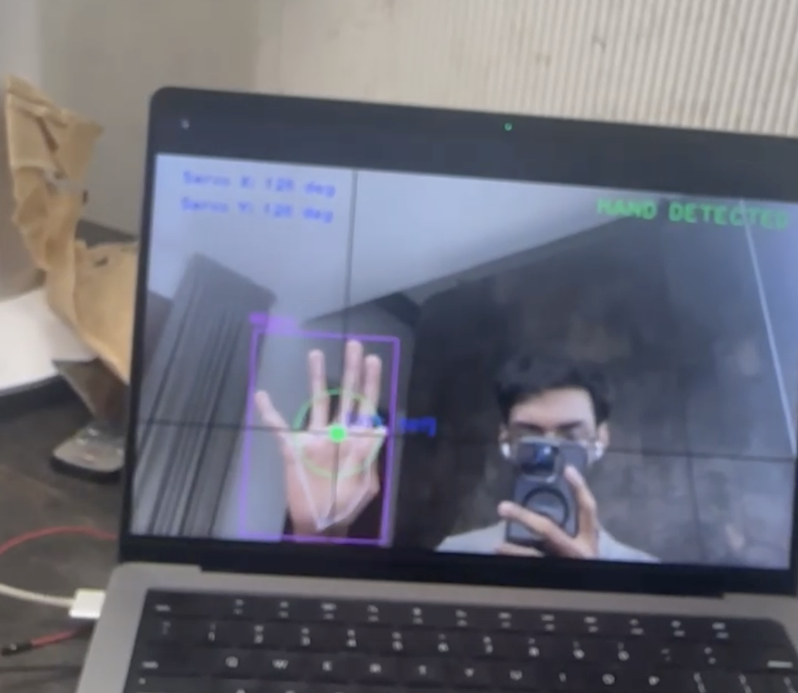
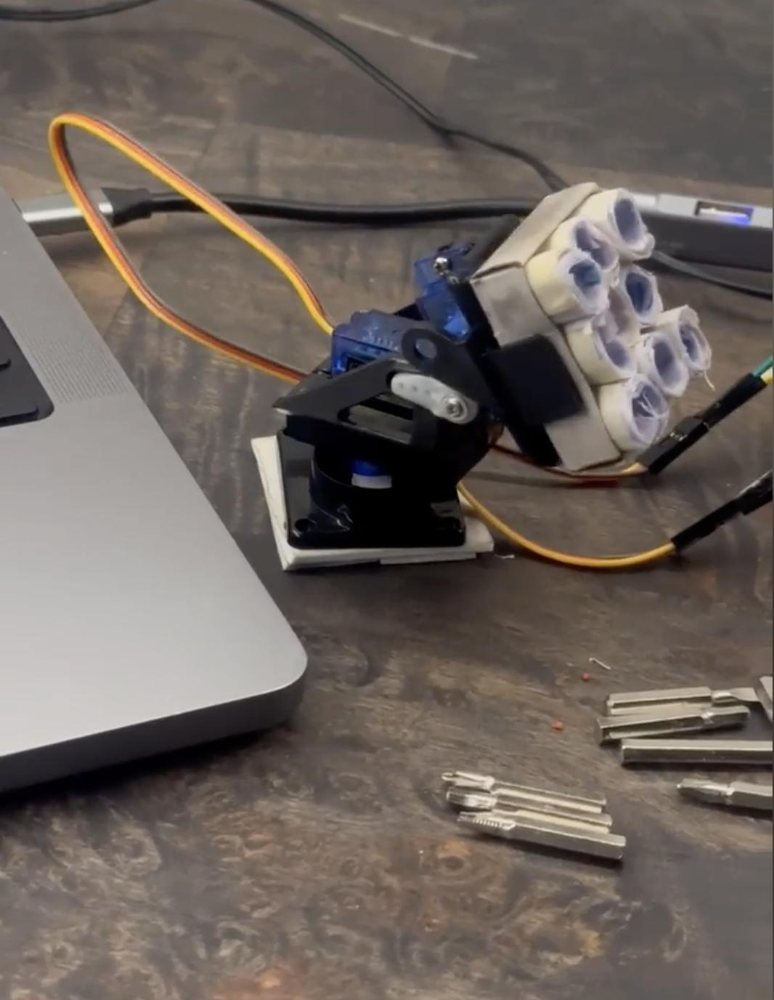

Please Watch DEMO video for Clarification about the project

````md
# 🖐️ Hand Tracking Project - PUG 2023

This project implements real-time hand tracking using computer vision and optionally controls servo motors through an **Arduino** microcontroller. Developed as part of the **PUG 2023** initiative, it offers an intuitive interface for detecting finger positions and translating them into motion commands.


---

## ✅ Features

- Real-time hand tracking using **MediaPipe**
- Precise finger position detection
- Optional **Arduino** integration for servo motor control
- Visual feedback with landmark visualization
- Coordinate mapping for servo movement control

---

## 🧰 Requirements

- Python 3.7+
- OpenCV
- MediaPipe
- NumPy
- PySerial (for Arduino integration)

---

## ⚙️ Installation

1. **Clone the repository**
   ```bash
   git clone https://github.com/[your-username]/hand-tracking-pug2023.git
   cd hand-tracking-pug2023
````

2. **Install dependencies**

   ```bash
   pip install -r requirements.txt
   ```

---

## 🚀 Usage

### ▶️ Basic Hand Tracking

To run hand tracking without Arduino:

```bash
python hand_tracking.py
```

### 🧠 Hand Tracking with Arduino Integration

1. Connect your **Arduino** via USB.
2. Open `hand_tracking_with_servos.py` and update the **serial port** (e.g., `COM3` for Windows or `/dev/ttyUSB0` for Linux).
3. Run the script:

```bash
python hand_tracking_with_servos.py
```

---

## 📁 Project Structure

```
hand-tracking-pug2023/
├── hand_tracking.py                # Basic hand tracking
├── hand_tracking_with_servos.py   # Hand tracking + Arduino
├── requirements.txt               # Python dependencies
├── assets/
│   ├── demo_image.jpg             # Demo image
│   └── demo.mp4                   # (Optional) Demo video
├── README.md                      # Project documentation
```

---

## 📽️ Demo

📥 [Click here to watch the demo video](https://bhargavteja-9779.github.io/Hand-Tracking-Project---PUG-2025-/assests/demo_video.mp4)


## 👤 LinkedIn

**P. N. Bhargav Teja**

[](https://www.linkedin.com/in/p-n-b-t)

---

## 🤝 Contributing

Contributions are welcome! Feel free to:

* Submit issues
* Suggest features
* Create pull requests

---

## 📄 License

This project is licensed under the **MIT License** – see the [LICENSE](LICENSE) file for details.

---

## 🙏 Acknowledgments

* [MediaPipe](https://mediapipe.dev/) – Hand tracking framework
* [OpenCV](https://opencv.org/) – Computer vision toolkit
* [Arduino](https://www.arduino.cc/) – Hardware and community

---

## 📬 Contact

📧 [bhargavteja.pn15@gmail.com](mailto:bhargavteja5098171@gmail.com)
🌐 [LinkedIn – Bhargav Teja](https://www.linkedin.com/in/p-n-b-t)
📍 VIT Vellore 

```
